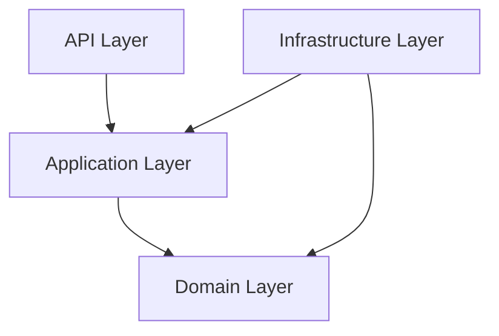

# Onion Architecture Rules

This project follows a strict Onion Architecture (Clean Architecture).

## Layers (from inside to outside)

1. **Domain (core/)**: Pure business logic, entities, protocols, and domain services.
2. **Application (use_cases/)**: Application-specific business rules, orchestrates domain objects.
3. **Infrastructure (infra/)**: Implementation details (DB, Kafka, Redis, DI).
4. **API (api/)**: Entry points (gRPC servicers, converters).

## Dependency Rules

- **Dependencies must always point inwards.**
- `core/` MUST NOT import from `use_cases/`, `infra/`, or `api/`.
- `use_cases/` MUST NOT import from `infra/` or `api/`.
- `infra/` and `api/` can import from `use_cases/` and `core/`.

## Prohibited Practices

- **No SQLAlchemy in Domain/Application**: `core/` and `use_cases/` MUST NOT import `sqlalchemy`. All DB operations must use protocols defined in `core/`.
- **No ORM models in Domain/Application**: Repositories must return Domain Entities (Pydantic models), not SQLAlchemy models.
- **Pure Python in Domain**: The domain layer should ideally have no heavy external dependencies.

## Diagrams



## Example File Structure
```
identity_service/
├── core/             # Layer 1
│   ├── users/
│   │   ├── entities.py
│   │   ├── repositories.py (Protocols)
│   │   └── services.py
├── use_cases/         # Layer 2
│   └── create_user.py
├── infra/            # Layer 3
│   ├── repositories/
│   │   └── user.py (Postgres impl)
│   └── db/orm/
│       └── user.py (SQLAlchemy models)
└── api/              # Layer 4
    └── servicers/
        └── identity.py
```
