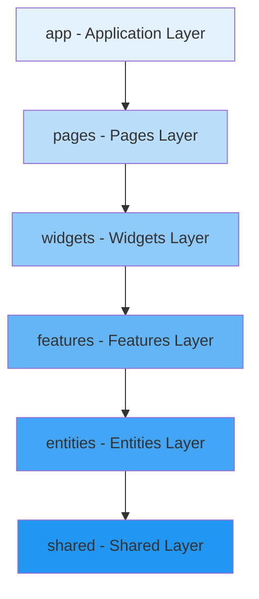

# Feature-Sliced Design Architecture

This project follows **Feature-Sliced Design (FSD)** methodology for frontend architecture.

## Layer Structure



## Layers (top to bottom)

### 1. app/ - Application initialization
- **Purpose**: App entry point, global providers, routing setup
- **Contains**: Providers (React Query, Theme, i18n), Routes, Global styles
- **Can import from**: All other layers
- **Example**: `app/providers/index.tsx`, `app/routes/index.tsx`

### 2. pages/ - Route pages
- **Purpose**: Full page components mapped to routes
- **Contains**: Page components that compose widgets and features
- **Can import from**: widgets, features, entities, shared
- **Cannot import from**: app, other pages
- **Example**: `pages/home/HomePage.tsx`, `pages/login/LoginPage.tsx`

### 3. widgets/ - Complex composite blocks
- **Purpose**: Reusable composite UI blocks (Header, Sidebar, etc.)
- **Contains**: Complex components combining multiple features/entities
- **Can import from**: features, entities, shared
- **Cannot import from**: app, pages, other widgets
- **Example**: `widgets/header/Header.tsx`, `widgets/sidebar/Sidebar.tsx`

### 4. features/ - Business features
- **Purpose**: User interactions and business logic
- **Contains**: Feature-specific UI, API calls, state management
- **Structure**: `features/<feature-name>/{api,model,ui,lib}/`
- **Can import from**: entities, shared
- **Cannot import from**: app, pages, widgets, other features
- **Example**: `features/auth/`, `features/create-user/`

### 5. entities/ - Business entities
- **Purpose**: Business entities and their representations
- **Contains**: Entity models, API, UI components, helpers
- **Structure**: `entities/<entity-name>/{api,model,ui,lib}/`
- **Can import from**: shared
- **Cannot import from**: app, pages, widgets, features, other entities
- **Example**: `entities/user/`, `entities/order/`

### 6. shared/ - Reusable code
- **Purpose**: Reusable utilities, UI primitives, configs
- **Contains**: `api/`, `lib/`, `ui/`, `config/`, `types/`
- **Can import from**: Only other shared modules
- **Cannot import from**: Any upper layers
- **Example**: `shared/ui/Button`, `shared/lib/hooks`, `shared/api/http-client`

## Dependency Rules (STRICT)

### Rule 1: One-way dependency flow
```
app → pages → widgets → features → entities → shared
```
- **NEVER** import from upper layers
- **NEVER** cross-import between features
- **NEVER** cross-import between entities

### Rule 2: Public API
Each layer/module must expose public API via `index.ts`:
```typescript
// ✅ Correct
import { Button } from "@shared/ui";
import { useAuth } from "@features/auth";

// ❌ Wrong - direct imports
import { Button } from "@shared/ui/Button/Button";
import { useAuth } from "@features/auth/lib/useAuth";
```

### Rule 3: Feature isolation
Features MUST be isolated:
```typescript
// ❌ WRONG - feature cross-import
import { useCreateOrder } from "@features/orders";

// ✅ CORRECT - communicate via entities
import { useUser } from "@entities/user";
```

### Rule 4: Shared is foundational
`shared/` contains NO business logic, only technical utilities:
```typescript
// ✅ CORRECT in shared/
export const cn = (...classes) => clsx(twMerge(...classes));
export const httpClient = axios.create({...});

// ❌ WRONG in shared/ - business logic
export const createUser = (data) => {...};
```

## Folder Structure Template

```
features/auth/
├── api/              # API calls
│   ├── authApi.ts
│   └── index.ts
├── model/            # State management (Zustand stores)
│   ├── authStore.ts
│   └── index.ts
├── ui/               # UI components
│   ├── LoginForm.tsx
│   ├── SignupForm.tsx
│   └── index.ts
├── lib/              # Helpers, hooks
│   ├── useAuth.ts
│   └── index.ts
└── index.ts          # Public API
```

## Common Violations

### ❌ VIOLATION 1: Cross-feature imports
```typescript
// features/orders/ui/OrderForm.tsx
import { useAuth } from "@features/auth"; // ❌ WRONG
```
**Solution**: Use entities or shared
```typescript
import { useUser } from "@entities/user"; // ✅ CORRECT
```

### ❌ VIOLATION 2: Upward imports
```typescript
// shared/ui/Button.tsx
import { useTheme } from "@app/providers"; // ❌ WRONG
```
**Solution**: Move theme logic to shared
```typescript
import { useTheme } from "@shared/lib/hooks"; // ✅ CORRECT
```

### ❌ VIOLATION 3: Direct file imports
```typescript
import { Button } from "@shared/ui/Button/Button"; // ❌ WRONG
```
**Solution**: Use public API
```typescript
import { Button } from "@shared/ui"; // ✅ CORRECT
```

## Migration Strategy

When refactoring old code:
1. Identify layer by responsibility
2. Move to appropriate FSD layer
3. Update imports to use public API
4. Ensure no cross-dependencies
5. Test isolation
