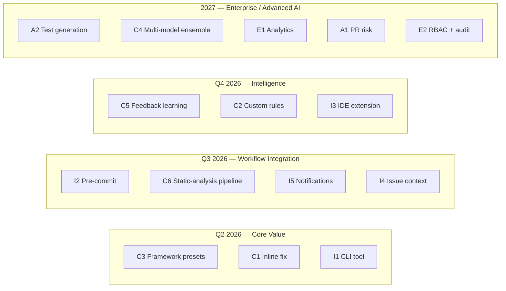

# mr-review — Product Roadmap

**Версия:** 2026-Q2 draft
**Автор:** backend-architect (team lead), команда mr-review-dev
**Статус:** черновик, требует валидации командой инженеров

---

## 1. Текущее состояние

`mr-review` — локальный AI-сервис автоматизации код-ревью MR/PR. Полностью оффлайн, без облака и аккаунтов. Поддерживает несколько VCS и AI-провайдеров, включая self-hosted (Ollama).

**Реализовано (Q1 2026):**

| Возможность | Описание |
| :--- | :--- |
| 4-этапный workflow | Brief → Dispatch → Polish → Post |
| Multi-VCS | GitHub, GitLab, Gitea, Forgejo, Bitbucket |
| Multi-AI | Claude, OpenAI, OpenAI-compatible (Ollama, self-hosted) |
| Review-источники | MR/PR + произвольный branch diff (issue #10) |
| Pin репозиториев по URL | Issue #9 — доступ к public-repo без membership |
| Concurrency-fence per AI | Issue #11 — защита от 429 и перегруза локальных моделей |
| Iterations / re-dispatch | Переиспользование предыдущих результатов |
| Inbox / темы / context-файлы | Контекст-окно для AI |

**Стек:** Python 3.11+, FastAPI, SQLAlchemy + SQLite, Dishka DI, React 19 + TypeScript + FSD.

---

## 2. Конкурентный ландшафт

| Параметр | mr-review | CodeRabbit | GitHub Copilot Review | Sourcery |
| :--- | :--- | :--- | :--- | :--- |
| Цена | бесплатно (self-host) | $24/мес/dev | $10–19/мес/dev + AI Credits | $10/мес/dev |
| Local-first / privacy | ✅ полностью оффлайн | ❌ облако | ❌ облако | ❌ облако |
| Multi-VCS | ✅ 5 платформ | ✅ 4 платформы | ❌ только GitHub | GitHub + GitLab |
| Multi-AI / BYOM | ✅ Claude/OpenAI/Ollama | частично | ❌ только Copilot | ❌ |
| Inline fix (apply diff) | ❌ только комментарии | ✅ Autofix (early) | ✅ Apply suggestions | частично |
| Static analysis pipeline | ❌ | ✅ ESLint/Ruff/Pylint/Trivy | ❌ | ✅ 200+ Python rules |
| Custom rules engine | ❌ | частично через .coderabbit | ❌ | ✅ .sourcery.yaml |
| Issue/ticket context | ❌ | ✅ Linear/Jira/MCP | частично | ❌ |
| IDE-расширение | ❌ | ✅ VS Code/Cursor/JetBrains | ✅ нативно | ✅ VS Code/Cursor/JetBrains |
| Code-graph / semantic search | ❌ | ✅ LanceDB | ✅ агентная архитектура | ❌ |
| CLI / pre-commit | ❌ | ✅ CLI | ❌ | ✅ через IDE |
| Audit / RBAC | ❌ | ✅ Enterprise | ✅ GitHub Enterprise | частично |
| Open source | ✅ | ❌ | ❌ | ❌ |

### Что делает `mr-review` уникальным

1. **Полная приватность** — единственный из top-tier, кто не отправляет код в облако. Критично для регулируемых индустрий (финтех, медтех, военка, госсектор) и для команд с NDA-кодом.
2. **Bring-Your-Own-Model** включая локальные модели — Ollama, llama.cpp, vLLM, self-hosted endpoints.
3. **Open source / self-host** — нет vendor lock-in.
4. **Human-in-the-loop "Polish"** — комментарии редактируются перед отправкой, а не публикуются автоматически. Это сильная сторона для команд, не готовых доверять полностью автономному ИИ.

### Где `mr-review` отстаёт

- Нет **inline fix suggestions** (только комментарии без готовых патчей).
- Нет **CLI / CI-интеграции** — невозможно встроить в pipeline.
- Нет **IDE-расширения** — обзор только через web-UI.
- Нет **custom rule engine** — нельзя зафиксировать архитектурные правила (Onion/FSD) как обязательные проверки.
- Нет **static-analysis pipeline** — не комбинирует AI с детерминированными линтерами.
- Нет **issue/ticket context** — AI ревьюит diff в вакууме без бизнес-контекста.

---

## 3. Боли пользователей

Анализ исходя из текущего workflow и опыта типичных команд:

1. **Ручное ревью медленное** — реviewers заняты, PR висят днями.
2. **Subtle violations** архитектурных правил уходят в master (Onion-слои, FSD-границы, naming conventions).
3. **Шум от стилевых комментариев** — занимают bandwidth, отвлекают от важного.
4. **Reviewers повторяют одни и те же замечания** — "ты опять забыл type hints", нет institutional memory.
5. **AI без контекста** галлюцинирует — ревью diff в вакууме без знания истории/тикета.
6. **Privacy-блокер** — многие команды не могут использовать облачные ревью-сервисы из-за NDA.
7. **Невозможно встроить в CI** — текущий `mr-review` только интерактивный, нет headless-режима.
8. **Нет measurement** — непонятно, какие комментарии полезны, какие игнорируют.
9. **Onboarding ревьюеров** долгий — junior'ы не знают всех тонкостей кодовой базы.
10. **Fragmented tooling** — отдельно линтеры, отдельно AI-ревью, отдельно security-сканеры.

---

## 4. Backlog фич с RICE-приоритизацией

**Формула:** Score = (Reach × Impact × Confidence) / Effort
- **Reach:** 1–10 (доля пользовательских сессий, на которые повлияет)
- **Impact:** 0.25 / 0.5 / 1 / 2 / 3 (от minimal до massive)
- **Confidence:** 0.5 / 0.8 / 1.0
- **Effort:** в person-weeks (предварительная оценка лида, требует валидации инженерии)

### 4.1 Core Platform

| # | Фича | Reach | Impact | Conf | Effort (pw) | RICE |
| :-- | :--- | :-: | :-: | :-: | :-: | :-: |
| C1 | **Inline fix suggestions** (AI генерирует patch-diff, кнопка "Apply" в Polish) | 10 | 3 | 0.8 | 8 | 3.0 ¹ |
| C2 | **Custom architectural rules engine** (yaml DSL: Onion-violations, FSD-borders, naming) | 6 | 2 | 0.8 | 5 | 1.92 |
| C3 | **Framework presets** (Django/FastAPI/React/Next.js — расширение Brief-пресетов) | 9 | 2 | 1.0 | 1 | **18.0** |
| C4 | **Multi-model ensemble** (Claude + GPT-4o + local → voting, reduce hallucinations) | 8 | 1 | 0.5 | 3 | 1.33 |
| C5 | **Feedback learning loop** (трекинг accepted/rejected комментариев, авто-уточнение промптов локально) | 9 | 2 | 0.6 | 4 | 2.70 |
| C6 | **Static-analysis pipeline** (Ruff/ESLint/Trivy/secrets-scan перед AI, AI работает с pre-filtered findings) | 7 | 2 | 0.8 | 3 | 3.73 |

### 4.2 Integrations

| # | Фича | Reach | Impact | Conf | Effort (pw) | RICE |
| :-- | :--- | :-: | :-: | :-: | :-: | :-: |
| I1 | **CLI tool** (`mr-review review <PR>` — headless, JSON output, exit code) | 7 | 2 | 1.0 | 2 | **7.0** |
| I2 | **Pre-commit hook** (быстрый sub-review staged-diff локальной моделью) | 6 | 1 | 0.8 | 1 | **4.8** |
| I3 | **VS Code / JetBrains extension** (inline AI-комменты до push) | 9 | 2 | 0.8 | 6 | 2.4 |
| I4 | **Issue/ticket context** (Jira/Linear/GitHub issues → prompt enrichment) | 5 | 1 | 0.8 | 2 | 2.0 |
| I5 | **Notifications** (Slack/Discord/email — ревью готово / нужно внимание) | 5 | 0.5 | 1.0 | 1 | 2.5 |

### 4.3 AI / ML

| # | Фича | Reach | Impact | Conf | Effort (pw) | RICE |
| :-- | :--- | :-: | :-: | :-: | :-: | :-: |
| A1 | **PR risk scoring** (size/files/history → "this PR has 73% chance of regression") | 7 | 1 | 0.5 | 3 | 1.17 |
| A2 | **Test generation** (auto-generated failing tests для изменённых code paths) | 8 | 2 | 0.5 | 5 | 1.6 |

### 4.4 Enterprise / Team

| # | Фича | Reach | Impact | Conf | Effort (pw) | RICE |
| :-- | :--- | :-: | :-: | :-: | :-: | :-: |
| E1 | **Team analytics dashboard** (top issues, review velocity, accepted/rejected rate) | 6 | 1 | 0.8 | 4 | 1.2 |
| E2 | **RBAC + audit log** (для команд с compliance: SOC2, ISO 27001) | 3 | 1 | 0.8 | 5 | 0.48 |

### 4.5 Итоговый ranked backlog

| Rank | # | Фича | RICE |
| :-: | :-- | :--- | :-: |
| 1 | C3 | Framework presets | 18.0 |
| 2 | I1 | CLI tool | 7.0 |
| 3 | C1 | Inline fix suggestions | 6.0 |
| 4 | I2 | Pre-commit hook | 4.8 |
| 5 | C6 | Static-analysis pipeline | 3.73 |
| 6 | C5 | Feedback learning loop | 2.7 |
| 7 | I5 | Notifications | 2.5 |
| 8 | I3 | VS Code extension | 2.4 |
| 9 | I4 | Issue/ticket context | 2.0 |
| 10 | C2 | Custom architectural rules | 1.92 |
| 11 | A2 | Test generation | 1.6 |
| 12 | C4 | Multi-model ensemble | 1.33 |
| 13 | E1 | Team analytics | 1.2 |
| 14 | A1 | PR risk scoring | 1.17 |
| 15 | E2 | RBAC + audit | 0.48 |

---

## 5. Стратегическая рекомендация #1 фичи

**Чистый RICE-лидер** — C3 (Framework presets). Это правильный quick win, но это **итерация на существующих пресетах**, а не headline-фича.

**Кандидат #2** — I1 (CLI tool). Открывает класс CI-сценариев, превращает `mr-review` из интерактивного инструмента в pipeline-tool. Низкий risk, высокая отдача.

**Кандидат #3** — C1 (Inline fix suggestions). Закрывает главное конкурентное отставание. Превращает "AI-комментатор" в "AI-помощник, который пишет код".

### Рекомендация лида

Идти параллельно треком:
- **Sprint 1 (quick win):** C3 Framework presets — 1 person-week, моментально расширяет ценность для популярных стеков.
- **Sprint 1–3 (headline):** **C1 Inline fix suggestions** как #1 для детальной спеки и инженерной валидации. Это стратегически важнее: устраняет основной gap vs CodeRabbit/Copilot, использует существующий "Polish"-этап как natural extension point, усиливает позиционирование "local AI does the work" (даже Ollama умеет писать diff).

**#1 фича для детальной спеки: C1 — Inline fix suggestions.**
Полная спецификация — `docs/specs/inline-fix-suggestions.md`.

---

## 6. Тематические треки

---

## 7. Open Questions

1. **Target persona** — фокус на solo-devs / small teams (приватность, простота) или enterprise (compliance, RBAC)? От ответа зависит вес E-track.
2. **Monetization plan** — остаётся ли проект полностью бесплатным open-source или появляются paid tiers (managed cloud, enterprise support)?
3. **Performance bar** — для CLI/pre-commit нужна latency <30s. Готовы ли инвестировать в оптимизацию streaming / caching?
4. **Maintenance load** — VS Code + JetBrains extension утроит surface area. Готовы ли поддерживать?

---

## 8. Метрики успеха роадмапа

- ⬆️ **PR turnaround time** (от opened до merged): baseline → −40%
- ⬆️ **Comments accepted rate** (после polish): baseline → +20%
- ⬆️ **Adoption** (active installs, weekly review sessions)
- ⬆️ **Architecture violations caught** до merge (требует C2)
- ⬆️ **CI-integrations** (% пользователей, использующих CLI/pre-commit)

---

## 9. Зависимости и порядок реализации

| Фича | Зависит от | Параллелится с |
| :--- | :--- | :--- |
| C3 Presets | — | всеми |
| C1 Inline fix | — | C3, I1 |
| I1 CLI | — | C3, C1 |
| I2 Pre-commit | I1 CLI | — |
| C6 Static-analysis | — | C1, I1 |
| C5 Feedback loop | C1 (apply rate как сигнал) | — |
| C2 Custom rules | — | C6 |
| I3 IDE extension | I1 CLI | — |
| A2 Test generation | C1 (diff-генерация) | — |
| E1 Analytics | C5 (события) | — |

---

**Статус:** документ требует валидации командой `mr-review-dev`:
- инженерные effort-оценки (особенно C1, I1, I3) — реалистичны?
- архитектурные риски — нет ли скрытых проблем с Onion при добавлении CLI/pre-commit?
- UX-фидбэк по Inline fix suggestions от frontend-engineer
- стратегия тестирования от qa-engineer
- инфраструктурные требования от devops-engineer
