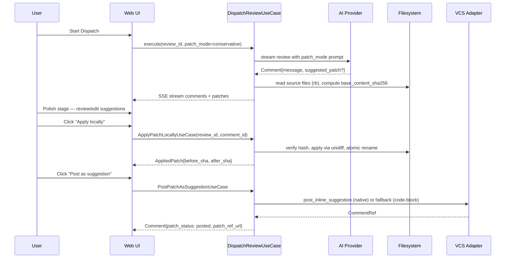

# Feature: Inline Fix Suggestions

**ID:** C1
**RICE:** 3.0 (Reach 10 × Impact 3 × Conf 0.8 / Effort 8 pw — после команд-валидации)
**Стратегический приоритет:** #1
**Статус:** Validated — готова к impl-decomposition

---

## Problem

Сегодня `mr-review` производит **только текстовые комментарии** — описывает проблему и рекомендуемое решение словами. Пользователь должен:
1. Прочитать комментарий.
2. Понять, как именно поменять код.
3. Открыть редактор и применить изменение вручную.

**Боль:**
- Для тривиальных правок (rename, missing type hint, неверный импорт, `Optional[str]` → `str | None`) этот цикл занимает в 5–10 раз больше времени, чем должен.
- Junior-разработчики могут неправильно интерпретировать комментарий и сломать код.
- Reviewers тратят bandwidth на повторное объяснение очевидных вещей.

**Почему это важно сейчас:** CodeRabbit (Autofix) и GitHub Copilot (Apply Suggestions) уже сместили рыночное ожидание. AI-ревью без diff-предложений воспринимается как "комментирующий советчик", а не как "co-pilot".

## Current State

В `mr-review` сейчас:
- AI выдаёт structured comments: `file_path`, `line`, `severity`, `message`.
- В этапе **Polish** пользователь редактирует/удаляет комментарии.
- В этапе **Post** комментарии публикуются как inline-notes в MR.
- **Storage**: `FileReviewRepository` пишет ревью в YAML-файлы `${DATA_DIR}/reviews/<uuid>.yaml`, atomic write через `tempfile + os.replace`.
- **Стриминг**: SSE (`sse-starlette`), а не WebSocket.
- **DI**: Dishka, use cases принимают `ReviewRepository` напрямую (не UoW — нет БД-транзакций).

**Workarounds:** копировать рекомендации из комментария в IDE вручную. Никакой автоматизации.

## Proposed Solution

Добавить **опциональный `suggested_patch`** в каждый комментарий — unified diff hunk, который пользователь может:
1. **Просмотреть** в Polish с подсветкой diff (зелёный/красный).
2. **Применить локально** — кнопка "Apply locally" редактирует файл в workspace.
3. **Опубликовать как GitHub/GitLab Suggested Change** — встроенный механизм платформ ("Commit suggestion" в GitHub UI).
4. **Откатить applied patch** — кнопка "Revert" (если backend поддержит `before_sha`).

### High-level архитектура



### Изменения по слоям

**Core (`mr_review/core/reviews/entities.py`):**
- Расширить `Comment` (Pydantic) опциональными полями:
  - `suggested_patch: SuggestedPatch | None = None`
  - `patch_status: PatchStatus = PatchStatus.PENDING` (enum: pending / applied / posted / discarded)
  - `patch_ref_url: str | None = None`
  - `patch_applied_at: datetime | None = None`
  - `patch_before_sha: str | None = None`
  - `patch_after_sha: str | None = None`
- Новые value-objects:
  - `SuggestedPatch { unified_diff: str, file_path: str, anchor_lines: tuple[int, int], base_sha: str | None, base_content_sha256: str, is_stale: bool, stats: PatchStats }`
  - `PatchStats { additions: int, deletions: int }`
  - `AppliedPatch { comment_id: UUID, before_sha: str, after_sha: str, applied_at: datetime }`
- Новый protocol `Telemetry` в `core/telemetry/`:
  - `record(event: TelemetryEvent) -> None`
- Расширить protocol `VCSClient`: `post_inline_suggestion(mr, comment, patch) -> CommentRef`, `supports_native_suggestions(self) -> bool` (capability флаг для fallback логики).

**Use Cases (`use_cases/reviews/`):**
- `dispatch_review.py` — добавить `patch_mode` в BriefConfig, при `!= off` передавать в prompt флаг, парсить ответ AI в `Comment` + `SuggestedPatch`. Снимать `base_content_sha256` файла на момент генерации.
- `apply_patch_locally.py` — **новый use case**:
  - Принимает `ReviewRepository`, `FilesystemRepository`, `Telemetry`.
  - Читает текущий контент файла (`open(path, "rb")`), считает SHA-256.
  - Сравнивает с `SuggestedPatch.base_content_sha256` → если mismatch, raise `StalePatchError` (HTTP 409 `PATCH_STALE`).
  - Применяет patch через `unidiff.PatchSet`.
  - Бэкап `.bak` рядом, atomic rename через `tempfile + os.replace`.
  - В `finally`: удаляет `.bak` (success) или restore (failure).
  - Сохраняет `before_sha/after_sha` в `Comment`, `patch_status=applied`.
  - Пересчитывает `is_stale` для других `Comment.suggested_patch` в том же файле.
  - `Telemetry.record(PatchAppliedEvent)`.
  - Возвращает `AppliedPatch`.
- `post_patch_as_suggestion.py` — **новый use case**:
  - Использует `VCSClient.post_inline_suggestion` для GitHub/GitLab; fallback на `post_comment` с ```` ```diff ```` блоком для Gitea/Forgejo/Bitbucket Server.
  - Возвращает обновлённый `Comment` с `patch_status=posted`, `patch_ref_url`.
- `discard_patch.py` — помечает `patch_status=discarded`, save.
- `revert_applied_patch.py` — проверяет `current_sha == after_sha` (иначе 409 `PATCH_REVERT_SHA_MISMATCH`), восстанавливает контент из patch reverse, статус → `pending`.

**Infra:**
- `infra/ai/prompts/` — обновить системный промпт под `patch_mode`. Формат ответа: JSON с опциональным полем `patch` (unified diff text).
- `infra/ai/parsers/patch_parser.py` — парсер unified-diff из AI-ответа, валидация формата через `unidiff`, security checks (path traversal `..` или абсолютный путь → reject, `Binary files differ` → reject, размер >50KiB → reject, BOM **сохраняется** не strip).
- `infra/filesystem/repository.py` — реализация `FilesystemRepository` protocol с **file-lock в протоколе с самого начала** (для будущей multi-process safety; для MVP — `asyncio.Lock` per-path).
- `infra/telemetry/jsonl.py` — `JsonlTelemetryRepository`: append-only в `${DATA_DIR}/telemetry/patches/YYYY-MM-DD.jsonl` через `asyncio.Lock` per-file.
- `infra/vcs/github/` — реализация `post_inline_suggestion` через native ```` ```suggestion ```` blocks; `supports_native_suggestions=True`.
- `infra/vcs/gitlab/` — через `suggested_changes` API; `supports_native_suggestions=True`.
- `infra/vcs/bitbucket_cloud/` — `suggestions` поле API; `supports_native_suggestions=True`.
- `infra/vcs/gitea/`, `forgejo/`, `bitbucket_server/` — `supports_native_suggestions=False` → use case использует fallback на code-block comment.

**API (`api/`):**
- `POST /reviews/{id}/comments/{cid}/apply-patch` → `AppliedPatch` | 404 / 409 / 422
- `POST /reviews/{id}/comments/{cid}/post-patch` → `Comment` | 404 / 409 / 502
- `POST /reviews/{id}/comments/{cid}/discard-patch` → `Comment` | 404
- `POST /reviews/{id}/comments/{cid}/revert-patch` → `Comment` | 404 / 409 / 422
- Error envelope (FastAPI HTTPException detail): `{ code: PatchErrorCode, message: str, context?: dict }`.
- Коды ошибок: `PATCH_NOT_FOUND` (404), `PATCH_STALE` (409), `PATCH_ALREADY_APPLIED` (409), `PATCH_ALREADY_POSTED` (409), `PATCH_INVALID_DIFF` (422), `PATCH_NO_BEFORE_SHA` (422), `PATCH_REVERT_SHA_MISMATCH` (409), `VCS_ERROR` (502).
- `GET /reviews/{id}` уже возвращает `Comment[]` — расширяется новыми опциональными полями + `is_stale` вычисляется на READ внутри `SuggestedPatch`.

**Frontend (FSD):**
- `entities/review/model/patch.schema.ts` — Zod-схемы (`SuggestedPatchSchema`, `PatchStatusSchema`, `PatchStatsSchema`, `AppliedPatchSchema`, `PatchErrorCodeSchema`, `PatchErrorEnvelopeSchema`).
- `entities/review/model/review.schema.ts` — extend `CommentSchema` 4 опциональными полями.
- `shared/ui/DiffViewer/` — переиспользуемый компонент (`<table>`-семантика, aria-labels, контраст-токены, dark/light, 8 stories) — **сделано в #ff1a0bc0**.
- `features/polish/ui/SuggestedPatchPanel.tsx` — header + diff body + actions (Apply/Post/Discard/Revert).
- `features/polish/api/` — 4 TanStack Query mutations (`applyPatch`, `postPatch`, `discardPatch`, `revertPatch`) с optimistic update + invalidation `reviewKeys.detail(reviewId)` после Apply (auto-pickup `is_stale` для соседей).
- `features/polish/model/usePatchActions.ts` — композиция мутаций + 9-state FSM.
- `features/polish/lib/usePatchHotkeys.ts` — A/P/D scoped hot-keys.
- Hot-keys: `A` (Apply) / `P` (Post) / `D` (Discard) — scoped к фокусу panel.
- i18n: RU + EN с v1.

## User Stories

- **Как** разработчик, **я хочу** видеть готовый patch-diff к каждому AI-комментарию, **чтобы** не переписывать код вручную.
- **Как** разработчик, **я хочу** применить patch локально одним кликом, **чтобы** проверить, что он не ломает build/tests до публикации.
- **Как** разработчик, **я хочу** опубликовать patch как GitHub/GitLab Suggested Change, **чтобы** автор PR мог принять его одним кликом в нативном UI.
- **Как** разработчик, **я хочу** откатить applied patch, **чтобы** быстро вернуть исходное состояние, если patch оказался плохим.
- **Как** team lead, **я хочу** настраивать `patch_mode` глобально/per-preset, **чтобы** отключить генерацию patches для большого/архитектурного PR (где AI patches опасны).
- **Как** пользователь Bitbucket/Forgejo, **я хочу** graceful fallback на текстовый комментарий с diff в code-block, **чтобы** фича работала на всех платформах.

## Acceptance Criteria

### Domain & Storage
- [ ] `Comment` entity содержит опциональные поля `suggested_patch`, `patch_status`, `patch_ref_url`, `patch_applied_at`, `patch_before_sha`, `patch_after_sha`.
- [ ] Старые YAML-ревью без новых полей валидируются (additive Pydantic, defaults).
- [ ] `SuggestedPatch.base_content_sha256` — SHA-256 от raw bytes файла (без нормализации line endings, без strip BOM).
- [ ] `is_stale` вычисляется на каждый READ через `GetReviewUseCase` (сравнение `base_content_sha256` vs текущий hash на диске).

### Apply pipeline
- [ ] AI-провайдеры (Claude, OpenAI, Ollama) генерируют patches в ≥70% подходящих комментариев (style, missing type hint, rename, simple refactor).
- [ ] Backend читает source files строго `open(path, "rb")` (raw bytes) — никаких `r`-режимов в pipeline.
- [ ] Parser отклоняет: malformed diff, `..` в file_path, абсолютный путь, symlink на файл вне workspace, бинарные файлы, size >50KiB.
- [ ] Path traversal validation как security-critical (separate AC) — symlink проверяется через `realpath`.
- [ ] Apply атомарен: `tempfile + os.replace`, `.bak` в `finally` для rollback на ошибке.
- [ ] StalePatchError (409 `PATCH_STALE`) — если `base_content_sha256` mismatch до apply.
- [ ] После Apply пересчитываются `is_stale` для других патчей в том же файле.

### Endpoints
- [ ] 4 endpoint'а: `apply-patch / post-patch / discard-patch / revert-patch` с structured error envelope.
- [ ] `post-patch` использует native suggestion API на GitHub/GitLab/Bitbucket Cloud, fallback на ```` ```diff ```` блок для Gitea/Forgejo/Bitbucket Server.
- [ ] `revert-patch` проверяет `current_sha == after_sha`, иначе 409 `PATCH_REVERT_SHA_MISMATCH`.

### UI
- [ ] `SuggestedPatchPanel` в Polish: 9-state FSM (Pending / Pending_Stale / Applying / Applied / ApplyError / Posting / Posted / PostError / Discarded).
- [ ] Race-edges (409 idempotency): 409 `PATCH_ALREADY_APPLIED` → переход в `Applied` с refetch (не `ApplyError`).
- [ ] Diff-viewer (`shared/ui/DiffViewer/`) — `<table>`-семантика, aria-labels per line, контраст light theme ≥4.5:1.
- [ ] Hot-keys A/P/D scoped к фокусу panel; respect `prefers-reduced-motion`.
- [ ] i18n RU/EN с v1.

### Feature flag & rollback
- [ ] `patch_mode` в `BriefConfig`: `off | conservative | aggressive`. **Default в первом релизе = `off`**.
- [ ] Env-override `MR_REVIEW__BRIEF__PATCH_MODE_OVERRIDE=off` для мгновенного rollback без rebuild.
- [ ] GA-релиз (minor +1) — default `conservative` после стабильного apply success rate ≥95%.

### Telemetry
- [ ] События `patch_generated/applied/posted/discarded/reverted` пишутся в JSONL `${DATA_DIR}/telemetry/patches/YYYY-MM-DD.jsonl`.
- [ ] Append-only через `asyncio.Lock` per-file. **Никакого PII** (только review_id, comment_id, file_path, patch_hash, provider, model).
- [ ] Retention 90 дней (cleanup-task — best-effort, опциональный).

### Coverage
- [ ] Backend: 90% lines+branches для use cases, 95% для AI parser, 85% для VCS adapters.
- [ ] Frontend: 85% lines+branches для `features/polish` и `shared/ui/DiffViewer/`.
- [ ] CI gates через `pytest --cov-fail-under` и `vitest coverage.thresholds`.

### Windows / cross-platform safety
- [ ] Integration-тесты: файл с CRLF на диске → apply корректен.
- [ ] Integration-тесты: файл с CRLF, но AI получил LF → apply падает `StalePatchError` (не молчит).
- [ ] Integration-тесты: файл с UTF-8 BOM → hash включает BOM, apply сохраняет BOM.
- [ ] Negative canary: если pipeline где-то делает `decode("utf-8-sig")` или `lstrip("")` — integration падает.

### Documentation
- [ ] `docs/features/inline-fix.md` — пользовательская документация фичи.
- [ ] `docs/operations/feature-flags.md` — реестр feature-flags (включая `patch_mode`) и процедура rollback.

## Success Metrics

| Метрика | Baseline | Target |
| :--- | :-: | :-: |
| % комментариев с suggested_patch (для подходящих) | 0% | ≥70% |
| % patches, применённых пользователем | n/a | ≥40% |
| Time-to-resolve trivial комментария (open → fixed) | ~3 мин | ≤30 сек |
| % patches, успешно применённых без ошибок | n/a | ≥95% |
| Доля пользователей, использовавших Apply хотя бы раз (за 30 дней после релиза) | 0% | ≥50% |

## Out of Scope (для первой итерации)

- Мульти-файловые patches (один комментарий = один файл).
- Авто-применение patches без подтверждения пользователя.
- AI-агент, который пишет fixes итеративно и коммитит сам (как CodeRabbit Autofix) — отдельная фича в будущем (C1.2).
- Резолв merge-конфликтов при apply.
- Откат уже опубликованных suggestions (только локальный Revert).
- Учёт текущего состояния working tree (uncommitted changes) — патч применяется к committed-версии файла; safety через `base_content_sha256`.
- **Patch syntax check** (linter после apply) — feature-flag `patch_syntax_check` на будущую итерацию.
- **Long-term apply snapshots** для отката после рестарта — `.bak` в `finally` только во время операции (C1.1 future).
- **Multi-file patches**, **streaming partial patches**, **AI re-roll patch на отказ** — все future.
- **Syntax highlighting** в hunk (prismjs/shiki) — v1.1.

## Technical Constraints

- **Backend Architecture (file-based, не Onion+SQL):**
  - Use cases принимают `ReviewRepository`, `FilesystemRepository`, `Telemetry` **напрямую** через DI — `AsyncUnitOfWork` неприменим (нет БД-транзакций).
  - Repository naming: `FileReviewRepository` (существующее), **не** `Postgres*Repository`.
  - Pydantic-additive поля в `Comment`, никаких Alembic-миграций.
  - Outbox-events → `JsonlTelemetryRepository` через `Telemetry` protocol.
  - Use cases остаются в `core/protocols` (interfaces) + `infra/` (implementations).
- **Frontend FSD:**
  - Diff-viewer — `shared/ui/DiffViewer/` (сделано в #ff1a0bc0).
  - Zod-схемы — `entities/review/model/patch.schema.ts` (сделано в #d82b1281).
  - Mutations и UI — `features/polish/{api,model,ui,lib}/`.
- **Type-safety:** все границы (AI parser, API, frontend) валидируются через Pydantic / Zod.
- **Безопасность apply:**
  - `open(path, "rb")` сквозь весь pipeline (никаких r-режимов, никакой `decode("utf-8-sig")`, никакого `lstrip BOM`).
  - SHA-256 от raw bytes для `base_content_sha256`.
  - Path traversal validation: `..`, абсолютный путь, symlink через `realpath`.
  - Atomic write: `tempfile + os.replace`, `.bak` в `finally`.
- **Совместимость VCS:** GitHub native `suggestion` blocks, GitLab `suggested_changes`, Bitbucket Cloud `suggestions`. Bitbucket Server / Gitea / Forgejo — fallback на ```` ```diff ```` блок в обычном комментарии.
- **AI prompt budgeting:** генерация patch увеличивает токены ~30%. Учитывать в rate-limit (issue #11).
- **SSE стриминг** (`sse-starlette`): добавить `max_event_bytes=256 KiB` guard на patch events.
- **Docker / dependencies:** `unidiff>=0.7` в `pyproject.toml`. `git` в runtime образе **НЕ нужен** — pure Python для apply. `git` в test-stage **нужен** для `tmp_git_repo` fixture.
- **CI:** `git config` на runner в integration job, `pytest-httpx` для VCS-моков. Без отдельных workflows.
- **Concurrent apply:** `FilesystemRepository` protocol включает file-lock с самого начала (`asyncio.Lock` per-path для MVP, `fcntl.flock`/Windows-аналог в будущем при multi-process).
- **Conventional commits:** `feat(reviews): inline patch suggestions`.

## Open Questions

Все ключевые вопросы закрыты в ходе валидации (см. историю комментариев на #88b70844 / #4372d67b / #29c9b303 / #1f9fb966).

Оставшиеся **продуктовые** вопросы (не блокируют impl):
1. **Target persona** — solo-devs / small teams vs enterprise? Влияет на приоритеты E-track.
2. **Monetization** — OSS-only или появятся paid tiers?
3. **Performance bar** — готовы инвестировать в latency <30s для CLI/pre-commit?
4. **Maintenance load** — потянем VS Code + JetBrains extensions параллельно?

## Dependencies

- **Параллельно:** C3 (Framework presets) — пресеты могут включать/выключать `patch_mode` по умолчанию.
- **Питает:** C5 (Feedback learning) — `patch_applied/discarded/reverted` события — signal для будущего обучения.
- **Питает:** I1 (CLI tool) — CLI получает `suggested_patch` в JSON-выводе.
- **Блокируется:** ничем.

## Effort Estimate (validated by team)

| Роль | Realistic (d) | PW |
| :--- | :-: | :-: |
| Backend (entities, repo extend, 4 use cases, AI parser, VCS adapters, telemetry impl) | 6 | ~1.2 |
| Frontend (DiffViewer ✅, Zod ✅, MSW ✅, SuggestedPatchPanel, 4 mutations, FSM, hot-keys, i18n) | 13 | 2.6 |
| QA (factories, 100+ unit, 18 integration, 27 frontend unit, 6 stories, E2E smoke) | 18 | 3.6 |
| DevOps (unidiff dep, CI git config, pytest-httpx, JSONL telemetry, feature-flag docs, smoke test) | 6 | 1.2 |
| **Total parallelizable** | **~3.5 calendar weeks** | **~8.6 pw** |

**Уже сделано** (parallel pre-impl tracks): DiffViewer refactor (`shared/ui/DiffViewer/`), Zod-схемы (`patch.schema.ts`), MSW handlers (9 FSM сценариев), test-infra fix (`pnpm patch expect-type`). Это сокращает frontend realistic с 13d → ~9d.

## Validation Plan

✅ Все 4 валидации выполнены:
- @backend-architect (#88b70844) — архитектура, контракт, endpoints.
- @frontend-engineer (#4372d67b) — UI/UX, FSD, 9-state FSM, A11y.
- @qa-engineer (#29c9b303) — test pyramid (~100 backend unit + 18 integration + 27 frontend unit + 6 stories + 1 E2E smoke), coverage gate 85%, Windows-triada CRLF/CRLF-flip/BOM + canary.
- @devops-engineer (#1f9fb966) — JSONL telemetry, `unidiff` без git в runtime, feature-flag default `off`, `pnpm patch expect-type` для test-infra.

**Финальный go/no-go:** ✅ approved, готова к impl-decomposition.
